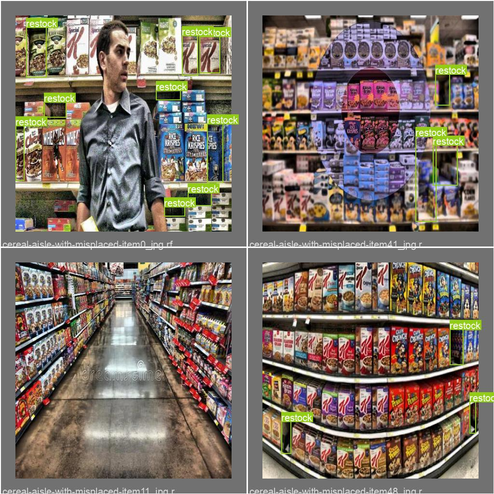
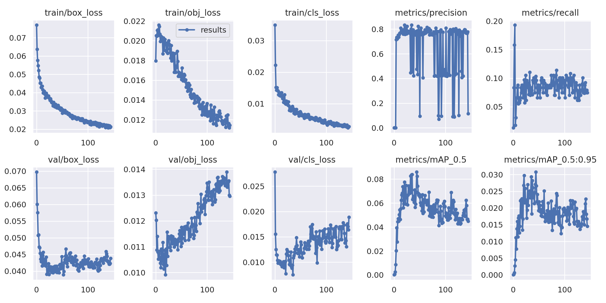

# Cereal Sentinel

### What does it do?

Cereal Sentinel makes the task of maintaining a perfect cereal aisle easier than ever before. It detects where a cereal aisle needs to be restocked, and in addition, it detects out-of-place or disorganized items. To build Cereal Sentinel, we labeled a dataset scraped from Google Images and trained YOLOv5 on it.

### Examples

Here are some example predictions of Cereal Sentinel:

<!--### Quickstart Guide for Local Development

First clone this repository. Navigate into the `/app` folder and run
`python3 -m main` to view the website.-->

  

## About Cereal Sentinel

Cereal Sentinel helps employees see which cereal aisle needs to be restocked, and which cereal or item is misplaced.  This will make it more efficient for employees to keep cereal aisles perfect, as they would be able to clean up isles methodically, only when the isle needs cleaning.

### How did we create the dataset?

We used SerpAPI to scrape images from Google Images and then used Roboflow to detect the missing and misplaced cereal. We applied several data augmentations to our data to improve performance: 

* Outputs per training example: 3
* Rotation: Between -15° and +15°
* Brightness: Between -25% and +25%
* Blur: Up to 5.25px
* Noise: Up to 3% of pixels

After applying the augmentations to the training data, we get the following train-validation-test split:

Our model suffers from class imbalance and noisy labels, as illustrated by the following graphic: 

The "restock" label is by far more prominent than the others. We ran into this problem because Google Images is more likely to display cereal aisles in need of restocking, while out\-of\-place and disorganized objects are less prevalent. We also have many different labels for the same things due to human bias: "Missing," "out of place," and "restock" refer to the same concept. However, in our subsequent iterations of training where we removed the noisy labels, the models performed worse. Hence we kept the redundant labels. This does not seem to be a problem in the confusion matrix of the predictions for the validation set, since the model never falsely predicts a noisy label:

#### How did we train the model? 

We trained YOLOv5 using Google Colab's GPU and evaluated it using weights and biases. We trained three runs, and found that the second run performed the best. Here are some plots from our second run:

We can see that the training losses decreased consistently with epochs \(x\-axis\), but the validation losses increased. This behavior is consistent with overfitting, so the model performs worse at a larger epoch. Therefore, we are using the weights of our model at epoch 42, which was found to have the lowest validation losses. At this epoch, our model has a precision of approximately 0.8 and a recall of approximately 0.1. The high precision means that any prediction our model makes is likely to have a corresponding true label, but the low recall means that our model retrieves only a fraction of true labels. This is ideal behavior for an understaffed grocery store because it means that an employee will not be barraged with false notifications that a cereal aisle needs tending.

## Our Team

* Victoria Li: Frontend Engineer & Visionary
* Mahnoor Babra: Frontend Designer
* Daniel Mercier: Product Manager
* Ethan Le: Data Scientist
* Danzel Ngo: Backend Developer
* Kevin Kim: Backend Developer
* Adam Mehdi: Data Science Instructor
    

### References

* [YOLOv5](https://github.com/ultralytics/yolov5)
* [OmniCV Repository](https://github.com/organization-x/omni/tree/omni_cv)

